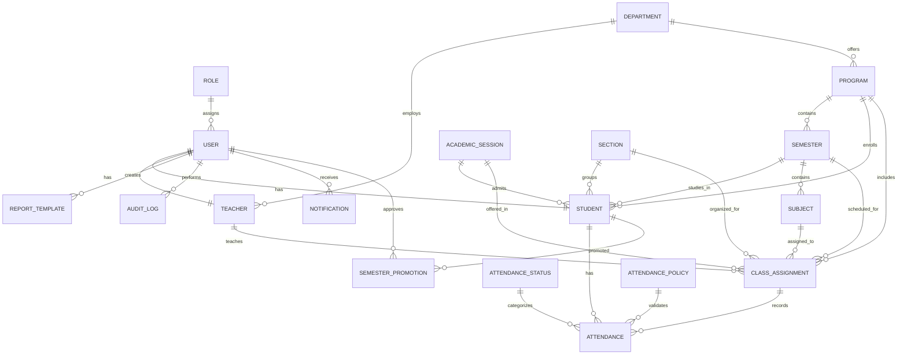

# Entity Relationship Diagram (ERD)

## Purpose

This document presents the Entity Relationship Diagram (ERD) for the SmartAttendify system. It illustrates the entities, their attributes (simplified), and the relationships between them. The ERD serves as the foundation for the PostgreSQL database schema, Prisma models, and backend API development.

---

# Scope

The ERD includes:

- Authentication
- User Management
- Academic Structure
- Attendance Management
- Attendance Policy
- Report Templates
- Notifications
- Audit Logs
- Semester Promotion

---

# Mermaid ER Diagram

---

# Entity Descriptions

## Authentication

- Role
- User

---

## Academic Structure

- Department
- Program
- Academic Session
- Semester
- Section
- Subject

---

## Academic Operations

- Student
- Teacher
- Class Assignment
- Attendance
- Attendance Status
- Attendance Policy

---

## Reporting

- Report Template

---

## System

- Notification
- Audit Log

---

## Academic Administration

- Semester Promotion

---

# Design Decisions

## Authentication

Authentication is separated from profile information.

User stores login credentials.

Student and Teacher store profile information.

---

## Attendance

Attendance is linked to Class Assignment instead of directly to Teacher or Subject.

This allows:

- Better normalization
- Easier timetable integration
- Future online attendance

---

## Promotion

Student IDs remain unchanged after semester promotion.

Promotion history is stored separately.

---

## Attendance Status

Attendance statuses are configurable.

Examples:

- Present
- Absent
- Leave
- Medical Leave
- Sports Duty

---

## Notifications

Notifications are stored for every user.

Future versions may support:

- Push Notifications
- Email Notifications

---

## Future Enhancements

Future versions may introduce:

- College
- Campus
- Parent
- Timetable
- Examination
- Marks
- Result
- Fee Management
- QR Attendance
- Face Recognition
- AI Attendance Analytics
