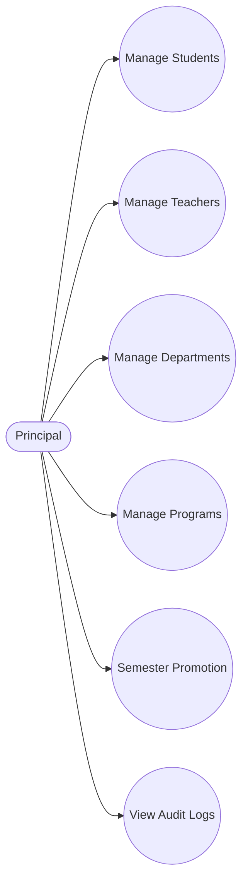

# Administration Use Case Diagram

```mermaid
flowchart LR

Principal([Principal])

StudentMgmt((Manage Students))
TeacherMgmt((Manage Teachers))
DepartmentMgmt((Manage Departments))
ProgramMgmt((Manage Programs))
Semester((Semester Promotion))
Audit((View Audit Logs))

Principal --> StudentMgmt
Principal --> TeacherMgmt
Principal --> DepartmentMgmt
Principal --> ProgramMgmt
Principal --> Semester
Principal --> Audit
```