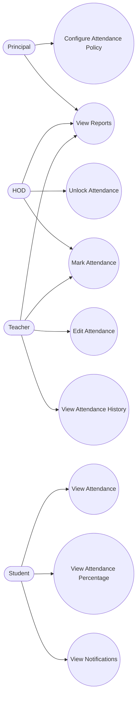

# Attendance Management Use Case Diagram

```mermaid
flowchart LR

Principal([Principal])
HOD([HOD])
Teacher([Teacher])
Student([Student])

Policy((Configure Attendance Policy))
Reports((View Reports))
Unlock((Unlock Attendance))
Mark((Mark Attendance))
Edit((Edit Attendance))
History((View Attendance History))
View((View Attendance))
Percentage((View Attendance Percentage))
Notify((View Notifications))

Principal --> Policy
Principal --> Reports

HOD --> Reports
HOD --> Unlock
HOD --> Mark

Teacher --> Mark
Teacher --> Edit
Teacher --> History
Teacher --> Reports

Student --> View
Student --> Percentage
Student --> Notify
```