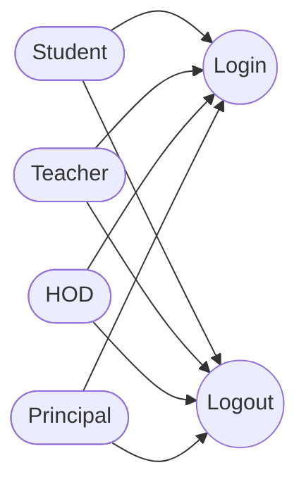

# Authentication Use Case Diagram

```mermaid
flowchart LR

Student([Student])
Teacher([Teacher])
HOD([HOD])
Principal([Principal])

Login((Login))
Logout((Logout))

Student --> Login
Teacher --> Login
HOD --> Login
Principal --> Login

Student --> Logout
Teacher --> Logout
HOD --> Logout
Principal --> Logout
```