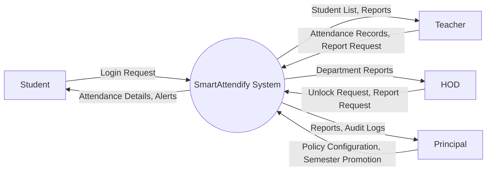

# Context Diagram (DFD Level 0)

## Purpose

The Context Diagram provides the highest-level view of the SmartAttendify system. It represents the entire application as a single process and illustrates how external entities interact with the system.

This diagram does not show internal processes or database details. Those will be covered in DFD Level 1 and Level 2.

---

## Scope

The Context Diagram includes:

- External Users
- Data exchanged with the system
- Overall system boundary

It excludes:

- Database tables
- Internal modules
- Business logic
- APIs

---

## Mermaid Diagram

---

## External Entities

### Student

The student can:

- Log in
- View attendance
- View attendance percentage
- Receive attendance alerts
- Download attendance reports (if permitted)

---

### Teacher

The teacher can:

- Log in
- Mark attendance
- Edit attendance
- Generate attendance reports

---

### HOD

The HOD can:

- Unlock attendance
- View department reports
- Monitor attendance activities

---

### Principal

The Principal can:

- Configure attendance policy
- Promote students
- Manage users
- View institution-wide reports
- Access audit logs

---

## Data Flows

| External Entity | Data Sent to System | Data Received from System |
|-----------------|---------------------|---------------------------|
| Student | Login Request, Report Request | Attendance Details, Alerts |
| Teacher | Attendance Records, Attendance Updates, Report Requests | Student Lists, Reports |
| HOD | Unlock Requests, Report Requests | Department Reports |
| Principal | Policy Configuration, Semester Promotion, User Management Requests | Reports, Audit Logs |

---

## Design Decisions

- SmartAttendify is represented as a single process.
- Only external interactions are shown.
- Internal modules are intentionally omitted.
- Database interactions are not shown at this level.

---

## Future Improvements

Future versions of SmartAttendify may introduce additional external entities such as:

- Parent/Guardian
- System Administrator
- University Portal
- Email Service
- SMS Gateway
- Mobile Application