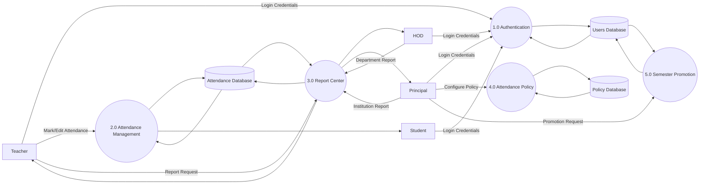

# DFD Level 1

## Purpose

DFD Level 1 decomposes the SmartAttendify system into its major functional processes. It illustrates how external entities interact with different modules of the system and how information flows between them.

This diagram provides a high-level understanding of the internal structure without showing implementation details or database tables.

---

## Scope

The DFD Level 1 includes:

- Major system processes
- External entities
- Data stores
- Data flows between processes

It excludes:

- Database schema
- API implementation
- Internal algorithms

---

## Mermaid Diagram

---

## Processes

### 1.0 Authentication

Responsible for:

- User login
- Credential validation
- Role identification
- Session creation

---

### 2.0 Attendance Management

Responsible for:

- Mark attendance
- Edit attendance
- Calculate attendance percentage
- Generate attendance alerts

---

### 3.0 Report Center

Responsible for:

- Generate reports
- Filter reports
- Export PDF
- Export Excel
- Print reports

---

### 4.0 Attendance Policy

Responsible for:

- Attendance percentage rules
- Warning thresholds
- Attendance statuses
- Edit window configuration

---

### 5.0 Semester Promotion

Responsible for:

- Student promotion
- Validation
- Promotion history
- Academic record update

---

## Data Stores

### D1 Users Database

Stores:

- Students
- Teachers
- HODs
- Principal

---

### D2 Attendance Database

Stores:

- Attendance records
- Attendance history
- Attendance statistics

---

### D3 Policy Database

Stores:

- Attendance rules
- Status configuration
- Alert configuration

---

## Design Decisions

- Authentication is separated from Attendance Management.
- Report generation is an independent module.
- Attendance policies are configurable.
- Semester Promotion is isolated as an administrative process.
- Data stores are shared where appropriate to avoid duplication.

---

## Future Improvements

Future versions may introduce:

- Notification Center
- Parent Portal
- Mobile App Integration
- AI Analytics
- Multi-college Management
- Audit Log Management