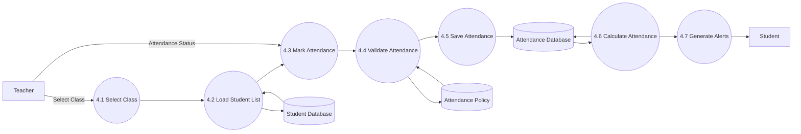

# DFD Level 2 – Attendance Management

## Purpose

This DFD decomposes the Attendance Management process into smaller sub-processes. It illustrates how attendance is recorded, validated, stored, and used to generate attendance statistics and alerts.

---

## Scope

Included:

- Mark Attendance
- Edit Attendance
- Validate Attendance
- Calculate Attendance Percentage
- Generate Attendance Alerts

Excluded:

- Authentication
- Reports
- Semester Promotion

---

## Mermaid Diagram

---

## Sub Processes

### 4.1 Select Class

Teacher selects:

- Academic Session
- Program
- Semester
- Section
- Subject

---

### 4.2 Load Student List

System retrieves all students assigned to the selected class.

---

### 4.3 Mark Attendance

Teacher marks each student's attendance status.

Example:

- Present
- Absent
- Leave
- Late

---

### 4.4 Validate Attendance

The system checks:

- Teacher authorization
- Attendance edit window
- Duplicate attendance records
- Valid attendance status

---

### 4.5 Save Attendance

Attendance records are stored securely.

---

### 4.6 Calculate Attendance

The system recalculates:

- Subject-wise attendance
- Overall attendance
- Attendance percentage

---

### 4.7 Generate Alerts

The system checks attendance against the configured policy and generates warnings where required.

---

## Data Stores

### Student Database

Stores:

- Student details
- Semester
- Program
- Section

---

### Attendance Database

Stores:

- Attendance records
- Attendance history
- Attendance statistics

---

### Attendance Policy

Stores:

- Minimum attendance percentage
- Warning threshold
- Critical threshold
- Attendance statuses

---

## Design Decisions

- Validation occurs before saving attendance.
- Attendance percentage is recalculated automatically.
- Alerts are generated immediately after attendance is saved.
- Attendance policies are configurable and not hard-coded.

---

## Future Improvements

Future versions may include:

- QR Code Attendance
- RFID Attendance
- Face Recognition
- GPS-based Attendance
- AI-based Attendance Anomaly Detection