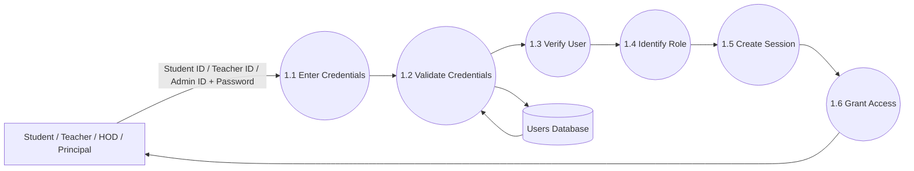

# DFD Level 2 – Authentication & Authorization

## Purpose

This DFD decomposes the Authentication & Authorization module into smaller processes. It illustrates how users authenticate themselves, how the system validates credentials, determines user roles, creates sessions, and grants access to authorized resources.

---

## Scope

Included:

- Login
- Credential Validation
- User Verification
- Role Identification
- Session Creation
- Authorization

Excluded:

- Attendance Management
- Report Generation
- Semester Promotion

---

## Mermaid Diagram

---

## Sub Processes

### 1.1 Enter Credentials

The user enters:

- User ID
- Password

The User ID may belong to:

- Student
- Teacher
- HOD
- Principal

---

### 1.2 Validate Credentials

The system validates:

- Required fields
- Password format
- Account existence

---

### 1.3 Verify User

The system checks:

- Account exists
- Account is active
- Password matches

---

### 1.4 Identify Role

The system determines whether the authenticated user is:

- Student
- Teacher
- HOD
- Principal

The identified role determines the available system features.

---

### 1.5 Create Session

The system:

- Creates a secure session
- Generates an authentication token
- Records login time

---

### 1.6 Grant Access

The user is redirected to the appropriate dashboard according to their role.

---

## Data Store

### Users Database

Stores:

- User ID
- Password Hash
- User Role
- Account Status
- Last Login
- Profile Information

---

## Design Decisions

- Passwords are stored as hashes.
- Role-based access control (RBAC) is implemented.
- One login page is used for all user roles.
- Sessions expire automatically after inactivity.

---

## Future Improvements

Future versions may support:

- Two-Factor Authentication (2FA)
- Biometric Login
- Single Sign-On (SSO)
- OAuth Integration
- Passwordless Authentication