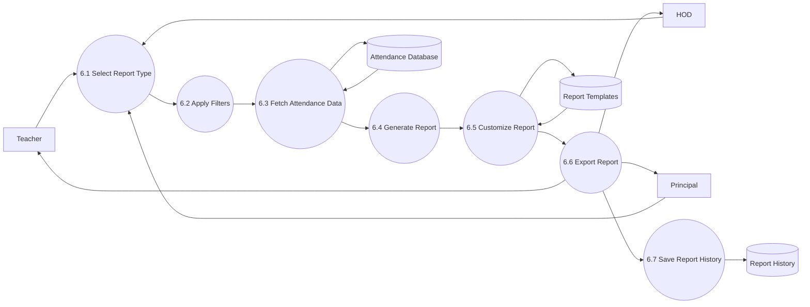

# DFD Level 2 – Report Center

## Purpose

This DFD decomposes the Report Center module into detailed sub-processes. It illustrates how authorized users generate attendance reports, apply filters, customize layouts, export reports, and access report history.

---

## Scope

Included:

- Generate Report
- Apply Filters
- Customize Report
- Export Report
- Report History

Excluded:

- Attendance Management
- Authentication
- Semester Promotion

---

## Mermaid Diagram

---

## Sub Processes

### 6.1 Select Report Type

The user selects one of the available report types.

Examples:

- Daily Attendance
- Monthly Attendance
- Subject-wise Report
- Semester Report
- Student Report
- Department Report
- Custom Report

---

### 6.2 Apply Filters

The user may filter reports by:

- Academic Session
- Department
- Program
- Semester
- Section
- Subject
- Teacher
- Date Range

---

### 6.3 Fetch Attendance Data

The system retrieves attendance data from the Attendance Database according to the selected filters.

---

### 6.4 Generate Report

The system:

- Calculates attendance statistics
- Generates summary information
- Prepares detailed report data

---

### 6.5 Customize Report

The user may customize:

- Visible columns
- Report layout
- College logo
- Signature section
- Header/Footer

Saved templates can also be applied.

---

### 6.6 Export Report

The report can be exported as:

- PDF
- Excel (.xlsx)
- Print

---

### 6.7 Save Report History

The generated report information is stored for future reference.

Stored information includes:

- Report Type
- Generated By
- Generated Date
- Export Format

---

## Data Stores

### Attendance Database

Stores:

- Attendance Records
- Attendance Statistics

---

### Report Templates

Stores:

- Saved Report Templates
- Shared Templates
- Layout Preferences

---

### Report History

Stores:

- Generated Reports
- Export Logs
- Report Metadata

---

## Design Decisions

- Report generation is independent from Attendance Management.
- Templates improve productivity.
- Report history allows users to review previously generated reports.
- Export options support PDF, Excel, and Print.

---

## Future Improvements

Future versions may include:

- Scheduled Reports
- Email Delivery
- Dashboard Analytics
- Interactive Charts
- CSV Export
- AI Attendance Insights