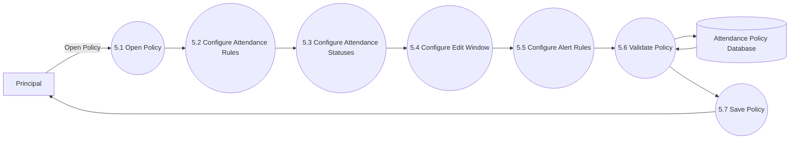

# DFD Level 2 – Attendance Policy Management

## Purpose

This DFD decomposes the Attendance Policy Management module into detailed sub-processes. It illustrates how the Principal configures attendance rules, validation settings, attendance statuses, edit windows, and student alert policies.

---

## Scope

Included:

- Configure Attendance Policy
- Manage Attendance Statuses
- Configure Edit Window
- Configure Alert Rules
- Save Policy

Excluded:

- Attendance Marking
- Authentication
- Report Generation
- Semester Promotion

---

## Mermaid Diagram

---

## Sub Processes

### 5.1 Open Policy

The Principal opens the Attendance Policy module.

The system loads the current policy configuration.

---

### 5.2 Configure Attendance Rules

The Principal configures:

- Minimum Attendance Percentage
- Warning Threshold
- Critical Threshold
- Attendance Calculation Method

Example:

- Overall Attendance
- Subject-wise Attendance

---

### 5.3 Configure Attendance Statuses

The Principal defines the attendance statuses available in the college.

Examples:

- Present
- Absent
- Leave
- Medical Leave
- On Duty
- Sports Duty

---

### 5.4 Configure Edit Window

The Principal specifies how long teachers are allowed to modify attendance records.

Examples:

- 6 Hours
- 24 Hours
- 2 Days

---

### 5.5 Configure Alert Rules

The Principal configures when attendance alerts should be generated.

Examples:

- Below 75%
- Below 60%
- Warning Notifications
- Critical Notifications

---

### 5.6 Validate Policy

The system validates:

- Percentage values
- Duplicate attendance statuses
- Valid edit window
- Required fields

---

### 5.7 Save Policy

The system stores the policy configuration and records the action in the Audit Log.

---

## Data Store

### Attendance Policy Database

Stores:

- Attendance Rules
- Attendance Statuses
- Alert Configuration
- Edit Window Settings

---

## Design Decisions

- Attendance policies are fully configurable.
- Attendance statuses are not hard-coded.
- Validation occurs before saving.
- Policy changes apply to future attendance operations.

---

## Future Improvements

Future versions may include:

- Different policies for different departments
- Different policies for different programs
- Holiday-specific attendance rules
- AI-based attendance recommendations