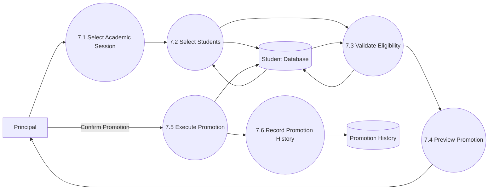

# DFD Level 2 – Semester Promotion

## Purpose

This DFD decomposes the Semester Promotion module into detailed sub-processes. It illustrates how the Principal promotes students to the next semester while preserving academic records and attendance history.

---

## Scope

Included:

- Select Academic Session
- Select Students
- Validate Promotion
- Preview Promotion
- Execute Promotion
- Record Promotion History

Excluded:

- Attendance Management
- Authentication
- Report Generation
- Attendance Policy

---

## Mermaid Diagram

---

## Sub Processes

### 7.1 Select Academic Session

The Principal selects:

- Academic Session
- Program
- Semester
- Section (if applicable)

---

### 7.2 Select Students

The system displays all eligible students.

The Principal may:

- Select all students
- Select individual students
- Exclude specific students

---

### 7.3 Validate Eligibility

The system validates:

- Student exists
- Student belongs to selected semester
- Student has not already been promoted
- Required academic conditions are satisfied

---

### 7.4 Preview Promotion

The system displays:

- Current Semester
- Next Semester
- Number of Students
- Students to be Promoted
- Students Excluded

The Principal reviews the promotion before confirmation.

---

### 7.5 Execute Promotion

The system:

- Updates the student's current semester
- Preserves Student ID
- Preserves attendance history
- Maintains academic records

---

### 7.6 Record Promotion History

The system stores:

- Promotion Date
- Academic Session
- Previous Semester
- New Semester
- Promoted By
- Number of Students
- Promotion Remarks

---

## Data Stores

### Student Database

Stores:

- Student Information
- Current Semester
- Academic Session
- Enrollment Details

---

### Promotion History

Stores:

- Promotion Records
- Audit Information
- Previous and New Semester Details

---

## Design Decisions

- Student IDs remain unchanged after promotion.
- Attendance history is preserved.
- Promotion requires validation before execution.
- A preview is shown before confirmation.
- Every promotion is recorded for auditing purposes.

---

## Future Improvements

Future versions may include:

- Automatic promotion rules
- Promotion rollback
- Promotion notifications
- Bulk promotion scheduling
- Department-wise promotion workflows